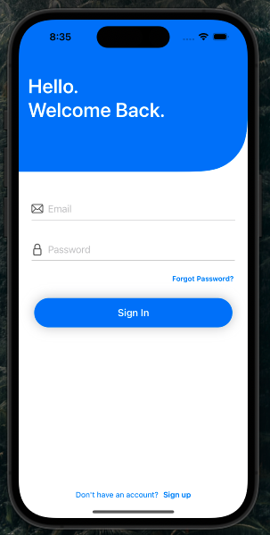
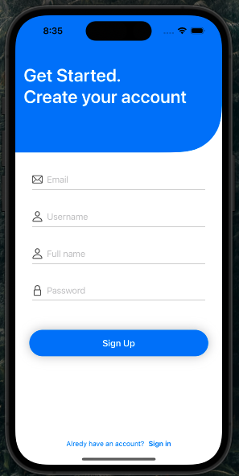
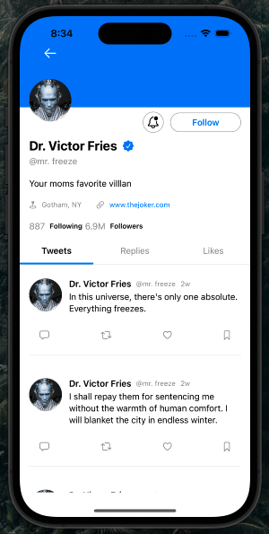
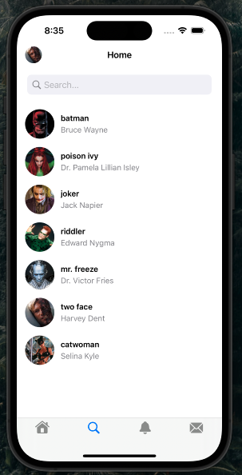
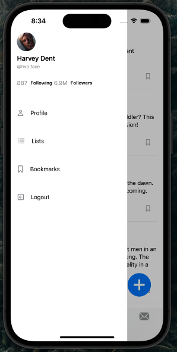

# Twitter
Full Stack Twitter App made with with SwiftUI.

### Preview

### Technologies Used 
* SwiftUI
* XCode
* FirebaseAuth
* KingFisher

### Features
* Login / Sign Up 
* Image Uploading / Downloading
* Side Menu 
* Twitter Feed 
* Like Tweets
* Send Tweets
* User Profile 
* User Search 
* Custom Views / Animations 
* Design 
* API / Server 